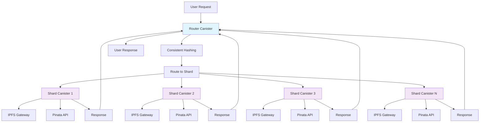

# dCDN Scaling Plan: Multi-Canister Architecture

## The Challenge

A single Internet Computer canister has finite storage capacity (currently limited to ~4GB of stable memory). As our dCDN grows to serve global content delivery needs, we will inevitably exceed these limits. A production-grade CDN must handle petabytes of data across millions of files, requiring a distributed architecture that can scale horizontally.

**Key Limitations:**
- Single canister storage limit (~4GB)
- Memory constraints for large-scale caching
- Performance bottlenecks with high concurrent requests
- Single point of failure for the entire system

## The Solution: A Multi-Canister Architecture

Our scaling strategy employs a **Router-Shard Architecture** that distributes content across multiple canisters while maintaining a unified interface for users.

### Router Canister

The **Router Canister** serves as the single entry point for all dCDN requests. Its primary responsibilities include:

- **Request Routing**: Takes incoming requests and applies a consistent hashing algorithm to the CID
- **Load Distribution**: Determines which Shard Canister is responsible for specific content
- **Inter-Canister Communication**: Forwards requests to appropriate shards using ICP's native inter-canister calls
- **Unified Interface**: Maintains the same API surface as the current single-canister implementation

**Consistent Hashing Algorithm:**
```rust
fn route_to_shard(cid: &str, total_shards: u32) -> u32 {
    use std::collections::hash_map::DefaultHasher;
    use std::hash::{Hash, Hasher};
    
    let mut hasher = DefaultHasher::new();
    cid.hash(&mut hasher);
    (hasher.finish() % total_shards as u64) as u32
}
```

### Shard Canisters

**Shard Canisters** are clones of our main dCDN canister, each responsible for a subset of the total cached data:

- **Distributed Storage**: Each shard holds approximately 1/N of the total cached content
- **Independent Operation**: Each shard operates autonomously with its own LRU cache and billing system
- **Horizontal Scaling**: New shards can be added dynamically as storage needs grow
- **Fault Isolation**: Failure of one shard doesn't affect the entire system

**Shard Responsibilities:**
- Content caching and retrieval
- LRU eviction management
- IPFS fetching and pinning
- Image resizing and transformations
- User account management (shard-local)
- Cycles billing and management

## Architectural Diagram



## Request Flow

1. **User Request**: Client sends request to Router Canister with CID
2. **Hashing**: Router applies consistent hash to CID to determine target shard
3. **Routing**: Router forwards request to appropriate Shard Canister
4. **Processing**: Shard processes request (cache lookup, IPFS fetch, image resize, etc.)
5. **Response**: Shard returns result to Router
6. **Delivery**: Router forwards response to user

## Future Enhancements

### Dynamic Scaling

This architecture enables **horizontal scaling** through dynamic shard management:

- **Auto-Scaling**: Monitor storage utilization and automatically deploy new shards
- **Load Balancing**: Distribute requests across shards based on current load
- **Geographic Distribution**: Deploy shards in different regions for reduced latency
- **Shard Migration**: Redistribute content when adding/removing shards

### Advanced Features

The multi-canister architecture unlocks several advanced capabilities:

- **Shard Specialization**: Dedicated shards for specific content types (images, videos, documents)
- **Replication**: Multiple shards can cache the same popular content for redundancy
- **Tiered Storage**: Hot content in fast shards, cold content in storage-optimized shards
- **Cross-Shard Analytics**: Aggregate usage statistics across all shards

### Implementation Roadmap

**Phase 1: Router Implementation**
- Create router canister with consistent hashing
- Implement inter-canister communication
- Maintain backward compatibility

**Phase 2: Shard Deployment**
- Deploy initial set of shard canisters
- Migrate existing data to distributed storage
- Implement shard health monitoring

**Phase 3: Dynamic Management**
- Add auto-scaling capabilities
- Implement shard migration tools
- Deploy monitoring and analytics

## Benefits

- **Infinite Scalability**: Add shards as needed to handle any storage requirements
- **High Availability**: No single point of failure
- **Performance**: Distributed load reduces latency and improves throughput
- **Cost Efficiency**: Pay only for the storage and compute you actually use
- **Fault Tolerance**: Individual shard failures don't affect the entire system

This architecture transforms our dCDN from a single-canister MVP into a production-ready, globally scalable content delivery network that can compete with traditional CDN providers while maintaining the unique advantages of blockchain-based infrastructure.
