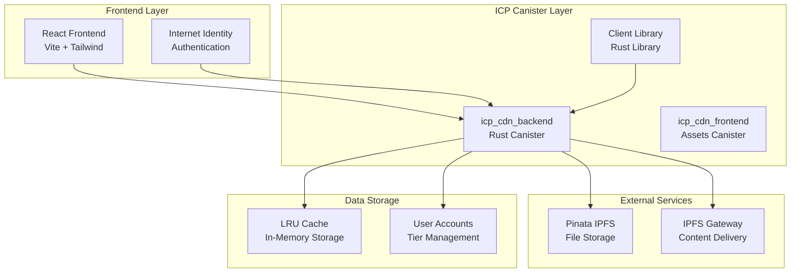
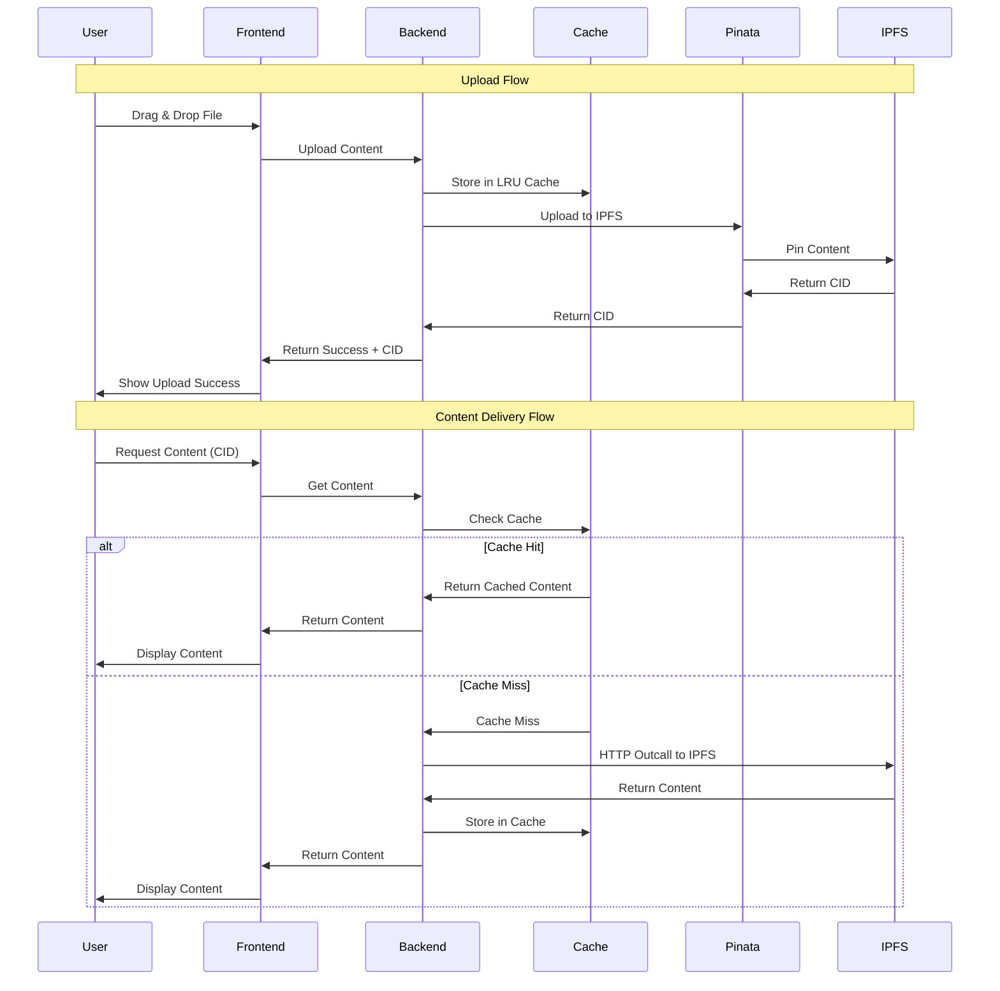
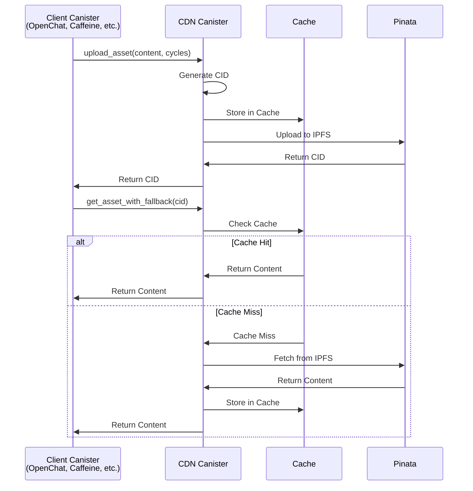

# 📊 **CanisterDrop: Architecture & User Flow Diagrams**

## 🏗️ **System Architecture**

### **High-Level Architecture**

---

## 🔄 **Core User Flows**

### **1. File Upload & Content Delivery Flow**

### **2. Canister-to-Canister Integration Flow**

---

## 🎯 **Key System Features**

### **Tier System**
- **Free**: 20MB cache, basic upload
- **Starter**: 50MB cache, IPFS pinning (1B cycles)
- **Pro**: 100MB cache, advanced features (5B cycles)
- **Business**: 500MB cache, enterprise features (15B cycles)

### **Cache Strategy**
- **LRU Eviction**: Automatic cache management
- **Tier-Based Limits**: Different cache sizes per user
- **Performance Optimization**: Fast access to frequently used content

### **Error Handling**
- **Graceful Degradation**: Fallback to IPFS when cache misses
- **Retry Logic**: Automatic retry for failed HTTP outcalls
- **User Feedback**: Clear error messages and status updates

---

*These diagrams show the essential architecture and user flows of CanisterDrop, demonstrating how it provides a seamless decentralized CDN experience for ICP developers.*
