# 📊 **CanisterDrop: Architecture & User Flow Diagrams**

## 🏗️ **System Architecture Diagrams**

### **1. High-Level System Architecture**

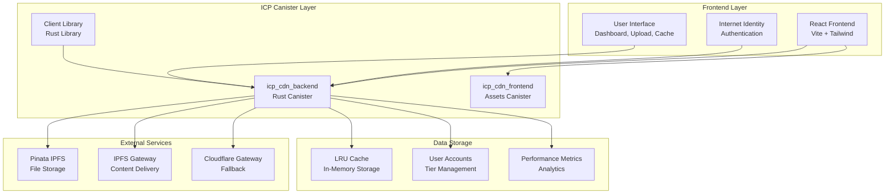

### **2. Detailed Canister Architecture**

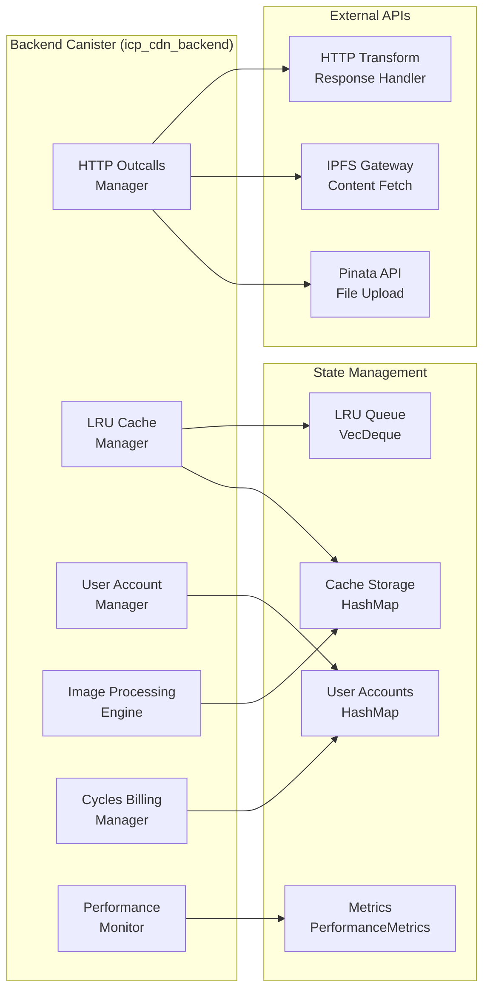

### **3. Data Flow Architecture**

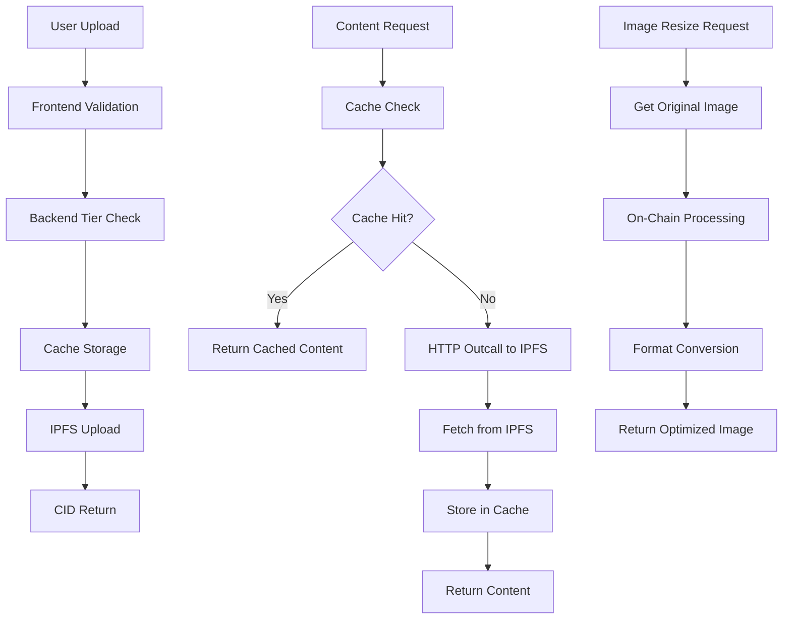

---

## 🔄 **User Flow Diagrams**

### **1. User Authentication Flow**

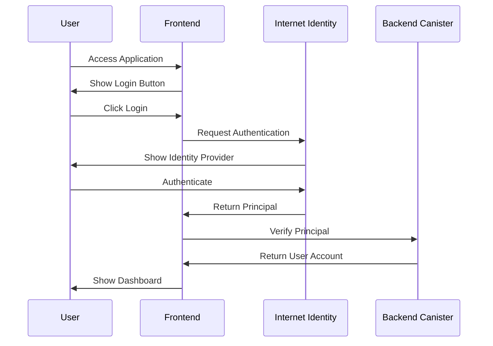

### **2. File Upload Flow**

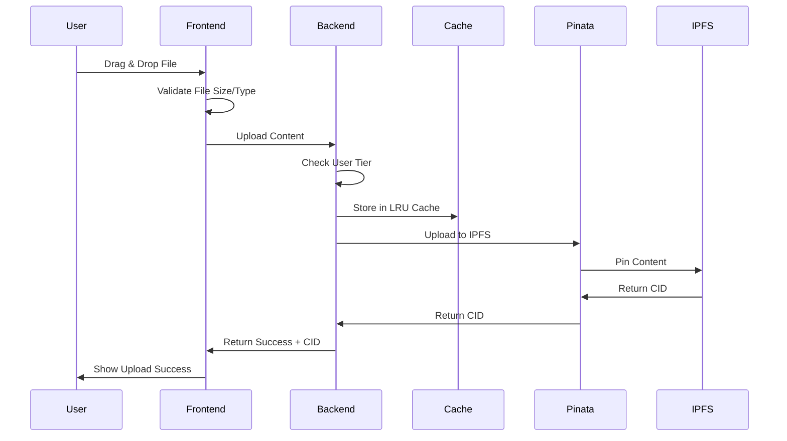

### **3. Content Delivery Flow**

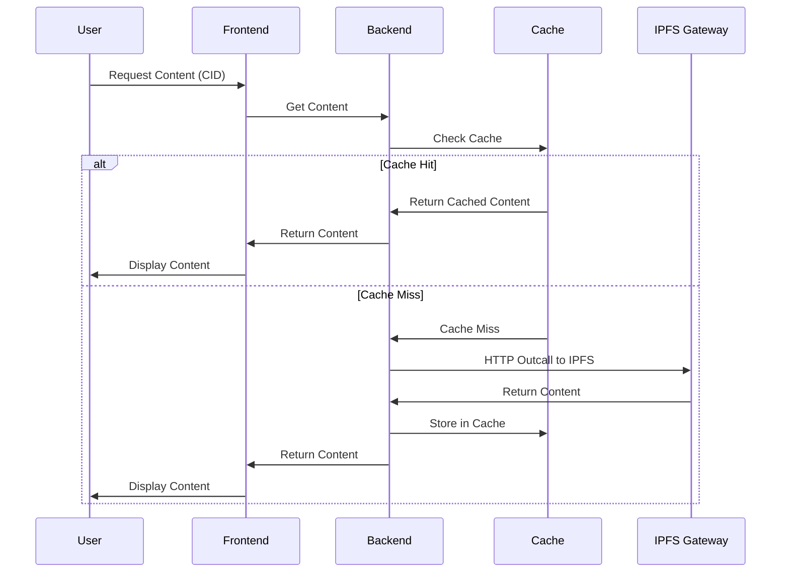

### **4. Image Processing Flow**

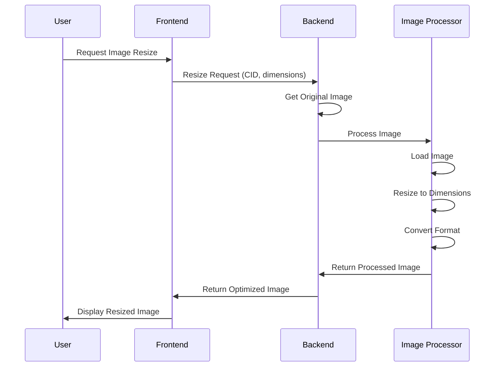

### **5. Tier Upgrade Flow**

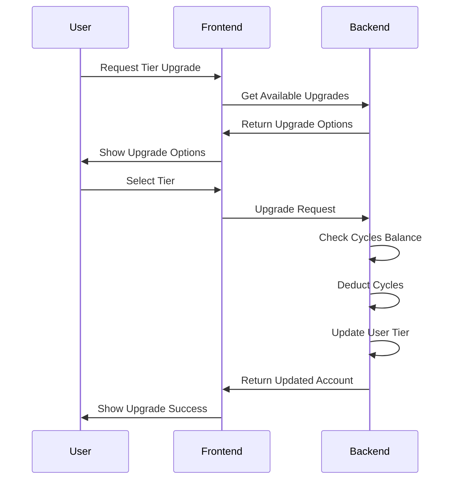

### **6. Canister-to-Canister Communication Flow**

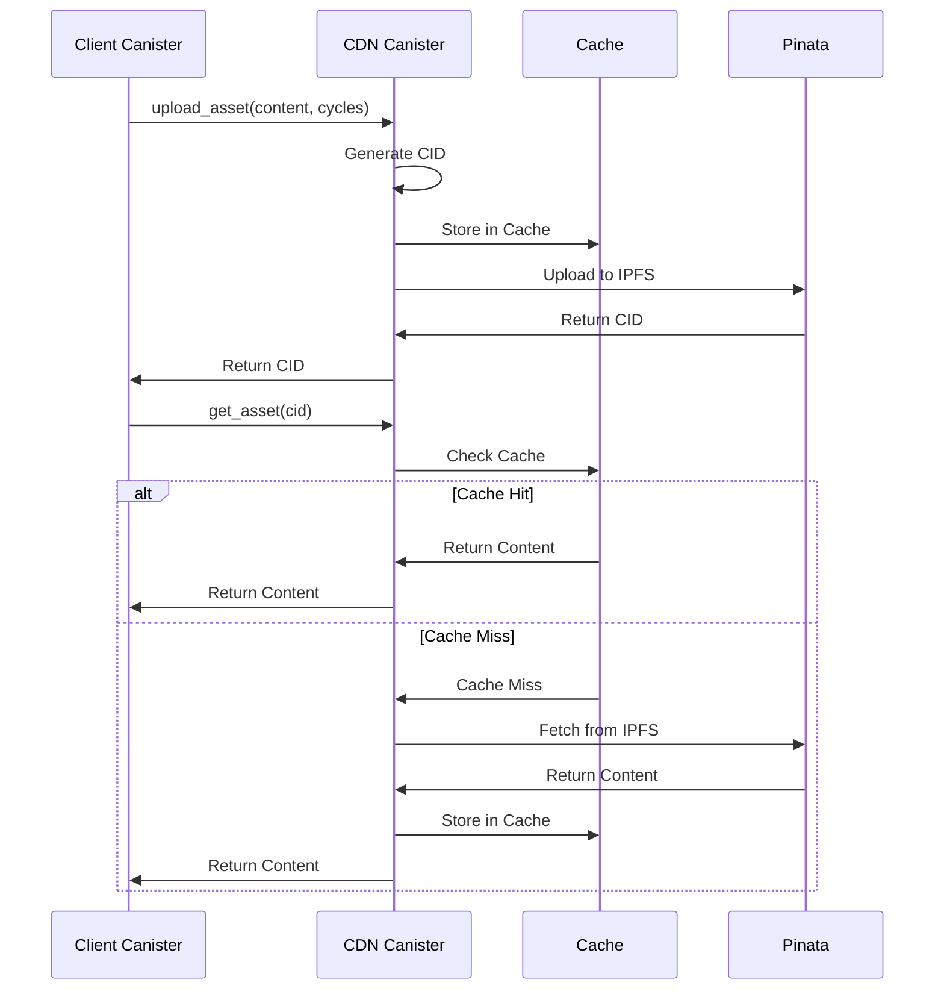

---

## 📊 **Component Interaction Diagrams**

### **1. Cache Management Flow**

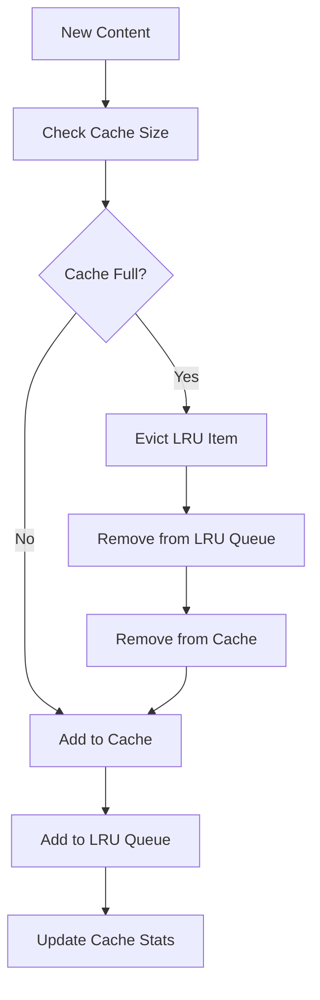

### **2. HTTP Outcall Flow**

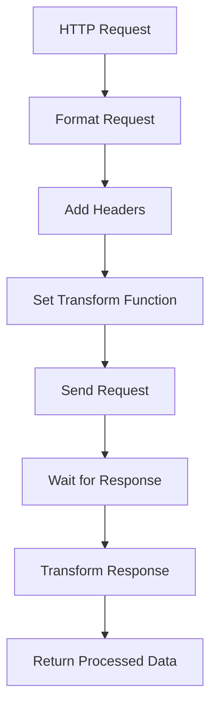

### **3. Performance Monitoring Flow**

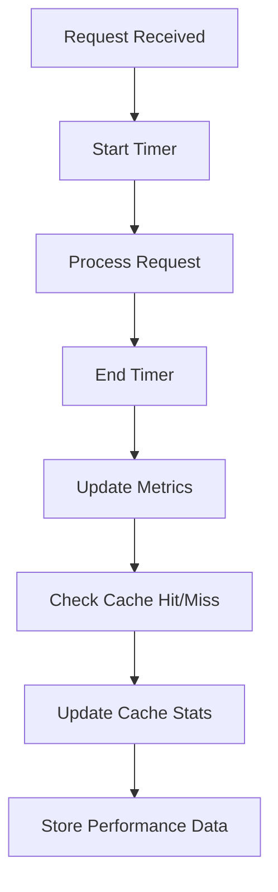

---

## 🎯 **Key System Interactions**

### **1. Multi-Tier Support**
- **Free Tier**: Basic upload, 20MB cache limit
- **Starter Tier**: IPFS pinning, 50MB cache limit
- **Pro Tier**: Advanced features, 100MB cache limit
- **Business Tier**: Enterprise features, 500MB cache limit

### **2. Cache Strategy**
- **LRU Eviction**: Least Recently Used items removed first
- **Tier-Based Limits**: Different cache sizes per user tier
- **Automatic Management**: No manual intervention required
- **Performance Optimization**: Fast access to frequently used content

### **3. Error Handling**
- **Graceful Degradation**: Fallback to IPFS when cache misses
- **Retry Logic**: Automatic retry for failed HTTP outcalls
- **User Feedback**: Clear error messages and status updates
- **Logging**: Comprehensive error logging for debugging

---

*These diagrams provide a comprehensive view of the CanisterDrop system architecture and user flows, showing how all components work together to deliver a seamless decentralized CDN experience.*
